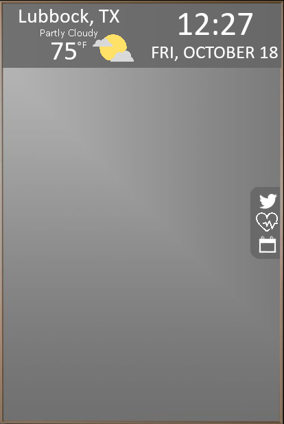
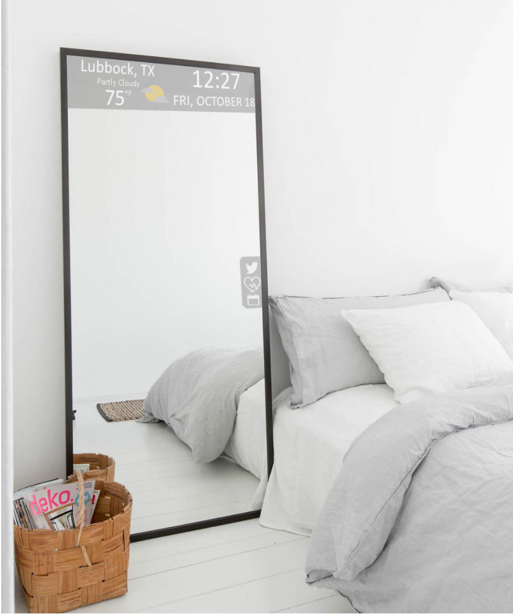

# PersonalMirrorProject Group 17

UI display when user selects the health option

Proof of concept

Duties

Caleb - Weather, clock, General U.I

Luis -  Music, Health information, General U.I 

Alex - Text, Calander Feeds.

Suhas - Social Feed and NewsFeeds.

Main Functions

*Health Tracking

*Time and Tempature readings

*Social Media feed

*Calander and Scheduals

Plan to Move forward

Implement UI and design features.

Extra features and customization. A menu for desired items at the top and more integrated applications.
